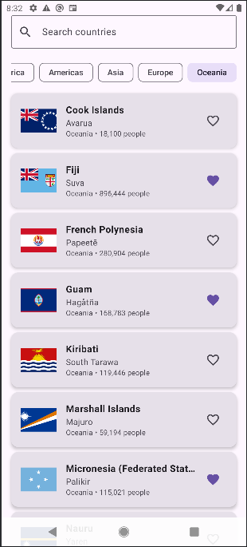
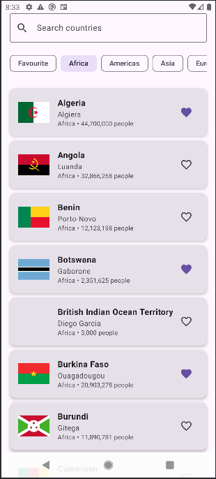
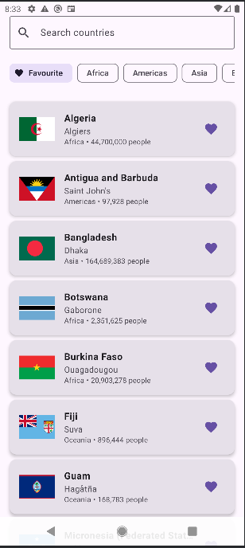

# Инф обо мне
- Рябенко Данила Игоревич
- Б9123-09.03.03ПИКД (1 группа + 2 подгруппа)

# Countries Explorer

Android приложение для изучения стран мира с использованием ApiCountries.com API.

## Функциональность выаолнено

**Навигация** - 2 экрана реализованы:
- CountriesScreen (Список/Поиск с фильтрами)
- CountryDetailScreen (Detail/{countryCode} с аргументом в route)

**Архитектура** 
- UiState паттерн: CountriesUiState и CountryDetailUiState со всеми необходимыми свойствами состояния
- ViewModel: CountriesViewModel и CountryDetailViewModel правильно реализованы
- Stateless UI: Экраны получают uiState + onEvent callbacks - полностью без состояния
- Repository паттерн: CountriesRepository находится между ViewModel и Retrofit API

**Coroutines + Retrofit** 
- Suspend функции: Все API вызовы в CountriesApi являются suspend функциями
- ViewModelScope: Все сетевые вызовы запускаются из viewModelScope.launch

**UI состояния** 
- Loading: CircularProgressIndicator с текстом "Loading..."
- Error: Сообщение об ошибке + функциональность кнопки "Retry"
- Empty: Состояния "No countries found" и "No favorite countries yet"
- Success: Отображение списка стран с правильными данными

**Избранное (локально, без БД)** 
- Добавить/Убрать: Иконка сердечка корректно переключает избранное
- Локальное хранение: Использует companion object в Repository (переживает поворот экрана)
- Постоянство: Избранное переживает поворот экрана через состояние ViewModel

**Доп**
- Debounce поиска без Flow: Job + delay(300–500ms) и отмена
- Логирование запросов (OkHttp logging)

## API

Приложение использует [ApiCountries.com](https://apicountries.com/) для получения информации о странах.

- **Полный список** - все 195+ стран мира
- **Стабильно работает** - без HTTP 400
- **Не требует API ключей** - бесплатный доступ
- **Богатые данные** - население, площадь, валюты, языки, флаги

## Room

Таблица favorites — одна колонка countryCode (PRIMARY KEY, тип String).

Сценарий использования: пользователь тапает на сердечко → countryCode пишется в Room → при следующем запуске FavoriteDao.observeAll() сразу эмитит сохранённые коды → CountriesRepository.favorites → ViewModel обновляет UI.

## Сценарий

1. Запустил приложение
2. Тапнул на сердечко у любой страны — иконка стала закрашенной
3. Убил приложение
4. Запустил снова
5. Открыл фильтр "Favourite" — страна там есть, сердечко закрашено

## Скрины работы приложения:

## Скрины работы ROOM:

## Тесты: 

**Юнит-тесты (10 штук):**

**CountriesViewModelTest — 6 тестов:**
1. начальное состояние: isLoading=true, список пустой, ошибки нет
2. успешная загрузка: список заполнен, isLoading=false, error=null
3. ошибка загрузки: error заполнен, список пустой
4. retry после ошибки: API вызван ровно 2 раза через coVerify ← нетривиальный
5. пустой результат даёт isEmpty=true, а не Success(emptyList)
6. цепочка состояний error → retry → success с проверкой промежуточных состояний ← нетривиальный

**CountryDetailViewModelTest — 2 теста:**
- SavedStateHandle передаёт правильный countryCode и загружает нужную страну
- retry на detail-экране делает новый запрос именно для того же countryCode ← нетривиальный

**ModelMappingTest — 2 теста:**
- toCountry() корректно маппит все поля из API-модели в доменную
- null-поля в API-модели остаются null в доменной, без случайных дефолтов

**Интеграционные тесты (9 штук):**

**FavoriteDaoTest — 3 теста  (реальный Room in-memory):**
- insert → read: данные корректно записываются и читаются
- двойной insert не создаёт дубль (OnConflictStrategy.IGNORE) ← нетривиальный
- delete удаляет запись, isFavorite возвращает false

**CountriesRepositoryIntegrationTest — 3 теста (Repository + FakeApi + реальный Room):**
- полный цикл избранного: добавить, проверить, получить список, удалить
- повторное добавление через Repository не создаёт дубль ← нетривиальный
- ошибка FakeApi возвращает Result.failure с правильным сообщением

**CountriesScreenIntegrationTest — 3 теста (Compose UI на эмуляторе):**
- success-состояние: на экране видны название страны и столица
- error-состояние → клик Retry → событие CountriesEvent.Retry сработало
- клик по стране вызывает навигацию именно с кодом "DEU" ← нетривиальный

## Возможные ошибки: 

**Плохо подгружаются данные с сайта** - если так получилось то во время запуска самого приложения и когда оно пишет Loading countries...
то включите ВПН и данные подгрузятся легко, либо можете поробовать сразу включить ВПН, не знаю  с чем это связано , но проблмы были только без ВПН